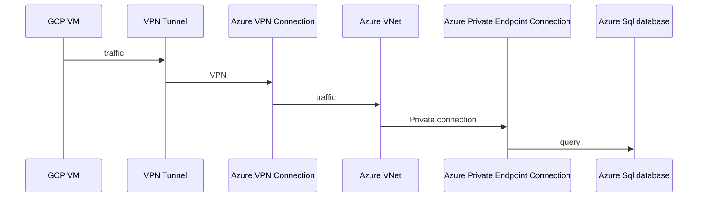
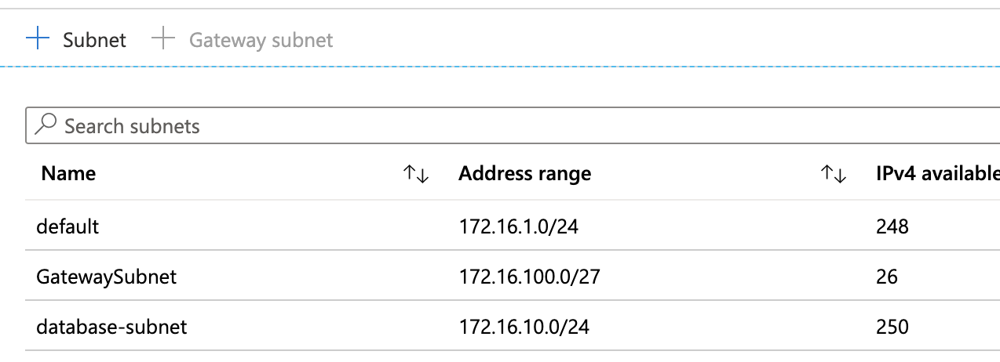
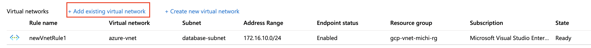
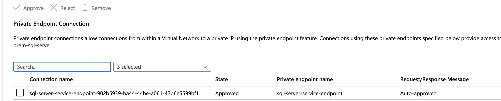
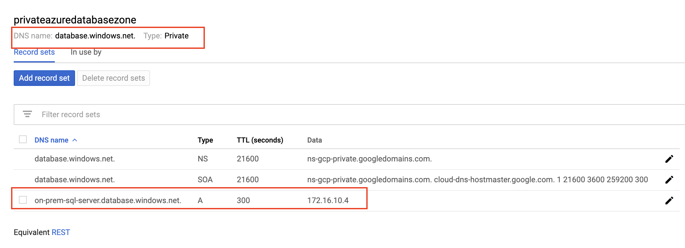
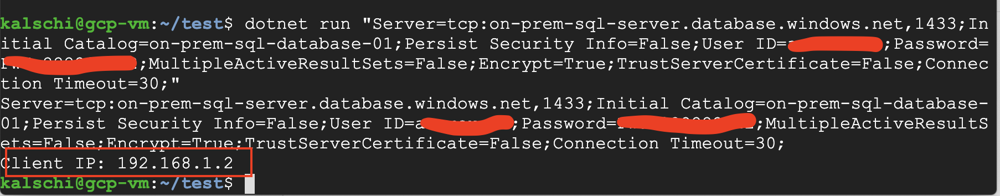

##  Overview

Below is a overall design of this connection.



####    Prerequesists

-   A Valid Azure Subscription

-   Follow [this document](https://github.com/michael-chi/gcp-hands-on-conversational-ai/blob/master/doc/vpn-setup.md) to setup VPN tunnel between GCP VPC and Azure Virtual Network

####    Azure Environment Setup

-   Create a Azure SQL Server and a Database with sample database template.

-   In the Azure Virtual Network we created in Prerequesists section, add a new subnet called database-subnet, we will use this subnet for our Azure SQL Database private access.



-   Go to Azure Portal, Azure SQL Server, Firewall and Virtual Networks. Associate newly created Azure SQL Database Server with the subnet we created above



-   Go to Azure Portal, Azure SQL Server, Private endpoint connections. Approve the automatically created connection if not already.



-   The Private IP address of the SQL Server should be the first available private IP address in that subnet, for example, if the subnet has CIDR of 172.16.0.0/24, first available IP is 172.16.0.4.

####    Google Cloud Environment Setup

-   Create a private Cloud DNS with below configuration. We need to resolve Azure Database Server's private IP address. This can also be done by modifying hosts file.



-   Create two VMs in same subnet which has VPN connectivity setup. One with Public IP address, one without Public IP address. We will use the VM with public IP as bastion host, the other as testing VM.

-   [Install dotnet 2.1 sdk](https://odan.github.io/2018/07/17/aspnet-core-2-ubuntu-setup.html) on the testing VM

-   Deploy [source codes](./src) and run below command to see it connects to Azure SQL database through VPN, then go through private connection. Hence Azure SQL Server recognizes client as from private network.

```bash
dotnet run <Connection String>
```


