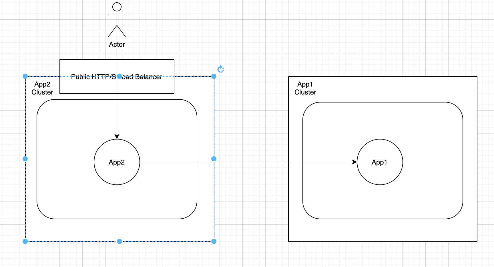
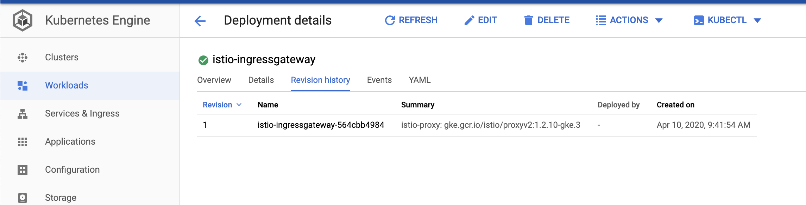

Overview
========



## References

[Istio Get Started](https://istio.io/docs/setup/getting-started/#bookinfo)

[Istio Multi-Cluster deployment model](https://istio.io/docs/ops/deployment/deployment-models/#multiple-clusters)

[Build Multi-Cluster Service Mesh across GKE clusters using Istio Single Control Panel](https://cloud.google.com/solutions/building-multi-cluster-service-mesh-across-gke-clusters-using-istio-single-control-plane-architecture-single-vpc#whats-next)

[Building a multi-cluster service mesh on GKE using replicated control-plane architecture](https://cloud.google.com/solutions/building-a-multi-cluster-service-mesh-on-gke-using-replicated-control-plane-architecture)


Configure multi-GKE cluster communication using Istio
=====================================================

##  Application Codes

Assume we have two clusters created <mark>WITHOUT</mark> Istio enabled.

|Cluster Name|Component|
|:---:|:---:|
|game-agones|app1|
|game-gke|app2|


In my [App2 code](./app2/app2.js), I have below code snips to call App1's API where App1's host are passed to App2 via environment variable

```javascript
var remote = env.process.REMOTE_HOST;
var resp = await request(remote);
```

##  Prepare kubectl to communicate to both GKE clusters

Go to cloud shell, now we want to easily control both clusters by adding clusters to kubeconfig file

First install helm and kubectx

```shell
mkdir $HOME/istio-multicluster-gke
cd $HOME/istio-multicluster-gke
export WORKDIR=$(pwd)
export HELM_VERSION=v2.13.0
export HELM_PATH="$WORKDIR"/helm-"$HELM_VERSION"

wget https://storage.googleapis.com/kubernetes-helm/helm-"$HELM_VERSION"-linux-amd64.tar.gz
tar -xvzf helm-"$HELM_VERSION"-linux-amd64.tar.gz
mv linux-amd64 "$HELM_PATH"
rm $WORKDIR/helm-"$HELM_VERSION"-linux-amd64.tar.gz

git clone https://github.com/ahmetb/kubectx $WORKDIR/kubectx
export PATH=$PATH:$WORKDIR/kubectx
```

Configure kubectl and kubectx

```shell
#   switch back to your code directory
export KUBECONFIG=istio-kubeconfig
export PROJECT_ID=$(gcloud info --format='value(config.project)')
export APP1_CLUSTER=game-agones
export APP2_CLUSTER=game-gke
export APP1_ZONE=asia-east1-b
export APP2_ZONE=asia-east1-a
gcloud container clusters get-credentials $APP1_CLUSTER --zone $APP1_ZONE --project ${PROJECT_ID}
gcloud container clusters get-credentials $APP2_CLUSTER --zone $APP2_ZONE --project ${PROJECT_ID}

#   rename context name for easier access
kubectx $APP1_CLUSTER=gke_${PROJECT_ID}_${APP1_ZONE}_${APP1_CLUSTER}
kubectx $APP2_CLUSTER=gke_${PROJECT_ID}_${APP2_ZONE}_${APP2_CLUSTER}
```

Give myself cluster-admin role on each cluster

```shell
kubectl create clusterrolebinding user-admin-binding \
    --clusterrole=cluster-admin --user=$(gcloud config get-value account) \
    --context $APP1_CLUSTER
kubectl create clusterrolebinding user-admin-binding \
    --clusterrole=cluster-admin --user=$(gcloud config get-value account) \
    --context $APP2_CLUSTER
```

## Install Istio

Go to cloud shell, run below commands to download Istio'

```shell
export ISTIO_VERSION=1.3.3
cd ~/
wget https://github.com/istio/istio/releases/download/${ISTIO_VERSION}/istio-${ISTIO_VERSION}-linux.tar.gz
tar -xzf istio-${ISTIO_VERSION}-linux.tar.gz
rm -r istio-${ISTIO_VERSION}-linux.tar.gz
```

Install Heml and Tiller to both cluster

```shell
kubectx $APP1_CLUSTER
kubectl create serviceaccount tiller --namespace kube-system;
kubectl create clusterrolebinding tiller-admin-binding \
    --clusterrole=cluster-admin --serviceaccount=kube-system:tiller;

${HELM_PATH}/helm init --service-account=tiller
${HELM_PATH}/helm update

kubectx $APP2_CLUSTER
kubectl create serviceaccount tiller --namespace kube-system;
kubectl create clusterrolebinding tiller-admin-binding \
    --clusterrole=cluster-admin --serviceaccount=kube-system:tiller;

${HELM_PATH}/helm init --service-account=tiller
${HELM_PATH}/helm update
```

##  Prepare Certificates for secure communication

Since I am using GKE with Istio enabled, Istio is already installed, then you can get Istio version from GCP console, below shows Istio version is 1.2.10-gke.3.
Otherwise we can follow this instruction to install [Istio](https://cloud.google.com/istio/docs/istio-on-gke/versions).



In order to setup secure connection we have to first generate certificates, here I have Istio provided [sample certs](../../doc/certs/), run below command to create K8s secrets for these certs

```shell
export ISTIO_VERSION=1.2.10
export APP1_CLUSTER=game-agones
export APP2_CLUSTER=game-gke
cd gke-cross-cluster-connectivity

kubectl --context $APP1_CLUSTER create secret generic cacerts -n istio-system \
--from-file=./doc/certs/ca-cert.pem \
--from-file=./doc/certs/ca-key.pem \
--from-file=./doc/certs/root-cert.pem \
--from-file=./doc/certs/cert-chain.pem;

kubectl --context $APP2_CLUSTER create secret generic cacerts -n istio-system \
--from-file=./doc/certs/ca-cert.pem \
--from-file=./doc/certs/ca-key.pem \
--from-file=./doc/certs/root-cert.pem \
--from-file=./doc/certs/cert-chain.pem;
```

## Installing Istio CRDs


Install Heml CRDs

```shell

kubectx $APP1_CLUSTER
${HELM_PATH}/helm install istio-${ISTIO_VERSION}/install/kubernetes/helm/istio-init --name istio-init --namespace istio-system

kubectx $APP2_CLUSTER
${HELM_PATH}/helm install istio-${ISTIO_VERSION}/install/kubernetes/helm/istio-init --name istio-init --namespace istio-system

```

Install Istio via Helm

```shell
cd ~/
git clone https://github.com/GoogleCloudPlatform/istio-multicluster-gke.git
cd ${WORKDIR}
for cluster in $(kubectx)
do
  kubectx $cluster;
  # ${HELM_PATH}/helm del istio --purge
  ${HELM_PATH}/helm install ~/istio-${ISTIO_VERSION}/install/kubernetes/helm/istio --name istio --namespace istio-system \
--values https://raw.githubusercontent.com/GoogleCloudPlatform/istio-multicluster-gke/master/istio-multi-controlplane/istio/values-istio-multicluster-gateways.yaml
done

```

To Verify if installation succeed, run below commnads
```shell

for cluster in $(kubectx)
do
  kubectx $cluster;
  kubectl get pods -n istio-system
done

##  Sample outputs  ##
# NAME                                             READY   STATUS      RESTARTS   AGE
# grafana-6fc987bd95-2qn7x                         1/1     Running     0          3m44s
# istio-citadel-68847df85-grrcx                    1/1     Running     0          3m32s
# istio-egressgateway-c78d849db-s77kk              1/1     Running     0          3m44s
# istio-galley-6545cbf95b-6b2jp                    1/1     Running     0          3m32s
```
##  Configure DNS

By default Istio uses K8s service registry to discover microservices in local cluster, we can expand service mesh to external clusters by defining ServiceEntries for microservices that are not in local cluster

The microservice running outside of local cluster has a DNS name end with ".global", services running inside lcoal cluster end with ".local"

Your services should be exposed to external cluster with DNS name of "service_name.namespace.global".

To create a ConfigMap in both clusters for .global as a stub domain, run below commands

```shell
for cluster in $(kubectx);
do
  kubectx $cluster;
  kubectl apply -f ./multiple-cluster/istio-multi-cluster-deployment/coredns-configMap.yaml 
done
```


To verify, first we get CoreDns IP in current cluster, you should see IP addresses output by both commands equal, which means when application tries to resolve .global domain, request will be forward to this POD to resolve.

```shell
kubectx $APP2_CLUSTER
kubectl get svc istiocoredns -n istio-system -o wide
kubectl get svc -n istio-system istiocoredns -o jsonpath={.spec.clusterIP}

# $ kubectl get svc istiocoredns -n istio-system -o wide
# NAME           TYPE        CLUSTER-IP   EXTERNAL-IP   PORT(S)         AGE    SELECTOR
# istiocoredns   ClusterIP   10.4.3.102   <none>        53/UDP,53/TCP   4m8s   app=istiocoredns
#
# $ kubectl get svc -n istio-system istiocoredns -o jsonpath={.spec.clusterIP}
# 10.4.3.102
```


Create a Service entry in APP2 Cluster so that when accessing APP1 Istio know how to resolve its name
```shell
kubectl apply -f ./multiple-cluster/istio-multi-cluster-deployment//app1-service-entry.yaml 
```

Enable sidecar injection
```shell
kubectl --context $APP1_CLUSTER label namespace default istio-injection=enabled
kubectl --context $APP2_CLUSTER label namespace default istio-injection=enabled
```


##  How things assembled together