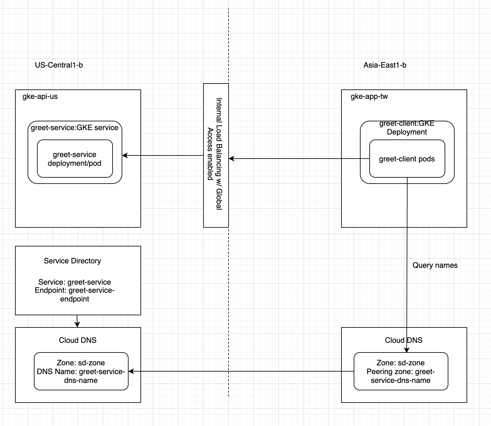

## Prerequisites

- Ensure Both VPCs in different regions and projects are peered via VPC Peering and routable

## Architecture

Here is the architecture we are deploying



## Configurations

#### GKE Component Table
|Components|Service|Client|
|:---:|:---:|:---:|
|Project|kalschi-td-001|kalschi-td-001|
|GKE Cluster|gke-api-us|gke-app-tw|
|VPC Network|vpc-td-us|vpc-td-tw|
|Subnet|td-us-central|td-tw|
|GKE ZONE|us-central1-b|asia-east1-b|vpc-td-tw|

#### Service Directory Table

|Service Directory Configuration Name|Value|
|:---:|:---:|
|Service Name|greet-servic|
|Cloud DNS Zone name|sd-zone|
|Endpoint name|greet-service-endpoing|
|Service DNS name|greet-service-dns-name|

## Steps

-  Create GKE Clusters for Services and Clients in different regions in different projects

```bash
## API Cluster Setup
export API_PROJECT_ID=kalschi-td-001
gcloud config set project $API_PROJECT_ID

export API_GKE_NAME=gke-api-us
export API_ZONE=us-central1-b
export API_NETWORK=projects/kalschi-td-001/global/networks/vpc-td-us
export API_SUBNET=projects/kalschi-td-001/regions/us-central1/subnetworks/td-us-central

gcloud beta container clusters create $API_GKE_NAME  --zone $API_ZONE --no-enable-basic-auth --cluster-version "1.14.10-gke.36" --machine-type "e2-standard-2" --image-type "COS" --disk-type "pd-standard" --disk-size "100" --scopes "https://www.googleapis.com/auth/cloud-platform" --num-nodes "1" --enable-stackdriver-kubernetes --enable-private-nodes --master-ipv4-cidr "192.168.100.0/28" --enable-master-global-access --enable-ip-alias --network $API_NETWORK --subnetwork $API_SUBNET --no-enable-master-authorized-networks --addons HorizontalPodAutoscaling,HttpLoadBalancing --enable-autoupgrade --enable-autorepair --max-surge-upgrade 1 --max-unavailable-upgrade 0

gcloud compute firewall-rules create allow-ingress-health-check --direction=INGRESS --priority=1000 --network=$API_NETWORK --action=ALLOW --rules=tcp --source-ranges 35.191.0.0/16,130.211.0.0/22

## Client Cluster
export APP_PROJECT_ID=kalschi-td-002
gcloud config set project $APP_PROJECT_ID

export APP_GKE_NAME=gke-app-tw
export APP_ZONE=asia-east1-b
export APP_NETWORK=projects/kalschi-td-002/global/networks/vpc-td-tw
export APP_SUBNET=projects/kalschi-td-002/regions/asia-east1/subnetworks/td-tw


gcloud beta container clusters create $APP_GKE_NAME  --zone $APP_ZONE --no-enable-basic-auth --cluster-version "1.14.10-gke.36" --machine-type "e2-standard-2" --image-type "COS" --disk-type "pd-standard" --disk-size "100" --scopes "https://www.googleapis.com/auth/cloud-platform" --num-nodes "1" --enable-stackdriver-kubernetes --enable-private-nodes --master-ipv4-cidr "192.168.100.0/28" --enable-master-global-access --enable-ip-alias --network $APP_NETWORK --subnetwork $APP_SUBNET --no-enable-master-authorized-networks --addons HorizontalPodAutoscaling,HttpLoadBalancing --enable-autoupgrade --enable-autorepair --max-surge-upgrade 1 --max-unavailable-upgrade 0

gcloud compute firewall-rules create allow-ingress-health-check --direction=INGRESS --priority=1000 --network=$APP_NETWORK --action=ALLOW --rules=tcp --source-ranges 35.191.0.0/16,130.211.0.0/22
```

-  Deploy Service application to GKE cluster
```bash
## Deploy, Manually enable ILB's Global Access after ILB created
gcloud container clusters get-credentials $API_GKE_NAME --zone $API_ZONE --project $API_PROJECT_ID
kubectl apply -f ./assets/server/app.yaml
```

- Setup Service Directory

```bash
## Service Directory
gcloud container clusters get-credentials $API_GKE_NAME --zone $API_ZONE --project $API_PROJECT_ID
export SD_NAMESPACE=kalschi-services
export SD_REGION=us-central1
gcloud beta service-directory namespaces create $SD_NAMESPACE \
   --location $SD_REGION

export SVC_NAME=greet-service
export EPT_NANE=greet-service-endpoing

gcloud beta service-directory services create $SVC_NAME \
   --metadata service_name=demo_server \
   --namespace $SD_NAMESPACE \
   --location $SD_REGION

## REPLACE $ADDRESS to your Internal Load Balancer's IP address
gcloud beta service-directory endpoints create $EPT_NANE \
   --address $ILB_ADDRESS \
   --port 50051 \
   --service greet-service \
   --namespace $SD_NAMESPACE \
   --location $SD_REGION
   
#### At this moment we are able to query the service name via API, next we want to enable DNS support so that client resolve names via DNS
export SD_DNS_NAME=greet-service-dns-name
export API_NETWORN_NAME=vpc-td-us
gcloud beta dns managed-zones create sd-zone \
   --dns-name $SD_DNS_NAME \
   --visibility private \
   --description "demo" \
   --networks https://www.googleapis.com/compute/v1/projects/$API_PROJECT_ID/global/networks/$API_NETWORN_NAME \
   --service-directory-namespace https://servicedirectory.googleapis.com/v1/projects/$API_PROJECT_ID/locations/$SD_REGION/namespaces/$SD_NAMESPACE
```

Now we can setup our client DNS peering so that our client applications are able resolve names coming from remote network/service directory
```bash
#### Query using DNS https://cloud.google.com/service-directory/docs/query-dns?hl=zh-tw
##### In VPC that hosts API GKE, you can simply `ping greet-service.greet-service-dns-name`
##### For remote VPC, Create a Private, Peering DNS
export APP_PROJECT_ID=kalschi-td-002
gcloud config set project $APP_PROJECT_ID

gcloud beta dns --project=kalschi-td-002 managed-zones create sd-name --description= --dns-name=greet-service-dns-name. --visibility=private --networks vpc-td-tw


```