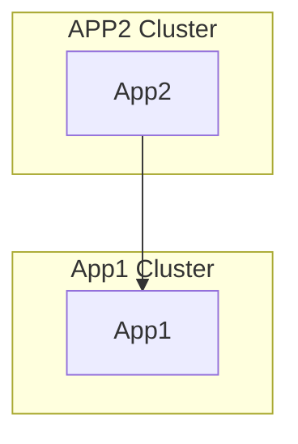

Overview
=======

在這個範例我會透過以下的sample solution示範怎麼透過Istio做multi-cluster communication



其中為了示範Istio的功能性, 我會有以下的設定

- Project ID: kalschi-istion

- Component Table

|GKE Cluster|Region|VCP|Deployment|Comments|
|----------|:-------------:|:-------------:|------:|------:|
|gke1|asia-east1|App1|App1 node.js|use default mode VPC|
|gke2|asia-northeast1|App2|App2 node.js|use default mode VPC|

>請安裝[Mermaid Chrome Extension](https://chrome.google.com/webstore/detail/mermaid-diagrams/phfcghedmopjadpojhmmaffjmfiakfil)以檢視flow chart.

程式碼
=====
完整程式碼在[這裏](./src), 其中在[app2.js](./src/app2/app2.js)中透過環境變數的方式取得App1的位置, 然後呼叫App1取得回覆

```javascript
var remote = process.env.REMOTE_HOST;
var resp = await request(remote);
```

詳細步驟
======

[準備環境](./00-setup-environment/readme.md)

[建立GKE Cluster](./01-create-clusters/readme.md)

[安裝Istio](./02-install-istio/readme.md)

[部署應用程式](./03-deploy-apps/readme.md)


References
==========
[gcloud container clusters create](https://cloud.google.com/sdk/gcloud/reference/container/clusters/create#--username)

[Istio Multi-Cluster GKE YAMLs](https://github.com/GoogleCloudPlatform/istio-multicluster-gke/tree/master/istio-multi-controlplane/istio)

[Istio - Multi Clusters](https://istio.io/docs/setup/install/multicluster/gateways/)

[Istio - Get Started](https://istio.io/docs/setup/getting-started/#bookinfo)